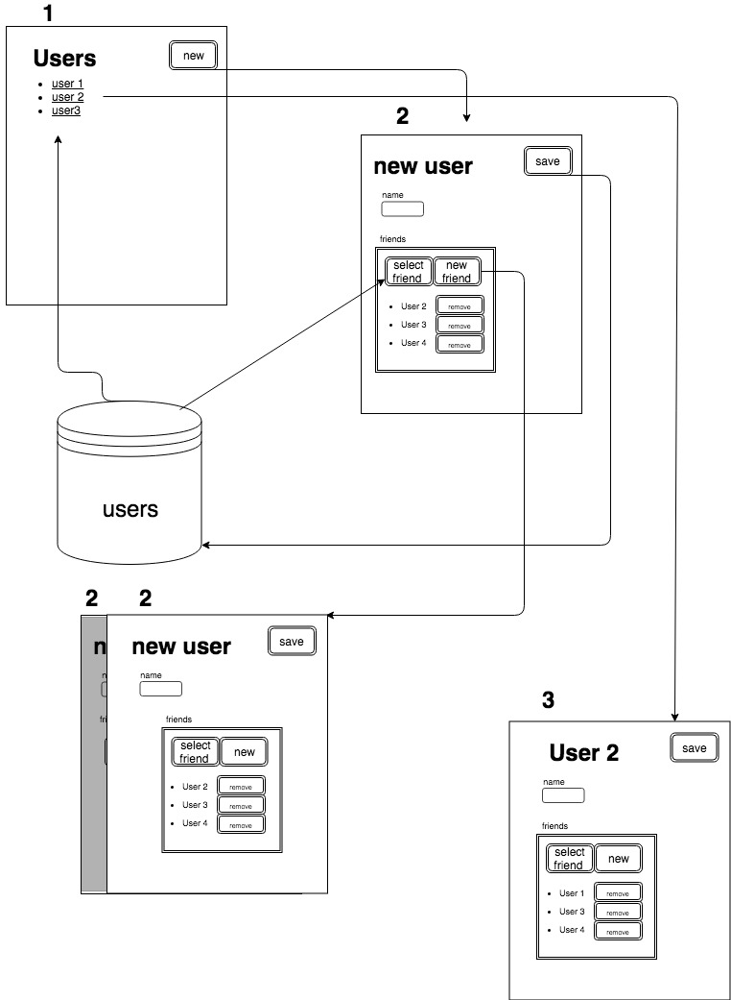

# Frontend assesment

I used the integrated toolchain create-react-app to fastly create the environment. 
I built myself the repo architecture using React/Redux/Redux-Saga as integration.
I employed barely more than a day time to execute the assesment, and in this time I reached the exposed result. I didn't consider to employ more time to ends up the test because I think it's enough to test my skills.

